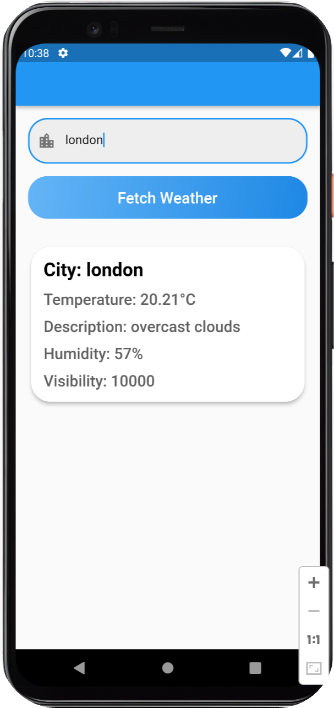

# Weather App with PythonAnywhere Backend

This is a repository for this video contains a weather application that leverages PythonAnywhere as its backend server. The backend fetches weather data from an external API and sends the information to the frontend, displaying the current weather details for a chosen city. For detailed explanation, watch this video.

## Features
Get real-time weather details.
Backend hosted on PythonAnywhere.
Simple and user-friendly interface.

## Prerequisites
Ensure you have the following installed:
- Python
- Flask

## Deployment
The backend of this app is deployed on PythonAnywhere. For deployment instructions, visit PythonAnywhere's Help Page. Use [this link](https://www.pythonanywhere.com/?affiliate_id=0029eba8) to sign up on the PythonAnywhere.
